<!-- hero: pixel-art portrait built from the GitHub avatar (types in row by row)
     beside a neofetch-style info card (lines slide in). Both are static SVGs:
       python scripts/prep_photo.py <image> && python scripts/make_ascii_svg.py
       python scripts/make_info_card.py
     Widths 340 + 480 = 820 so the row lines up with the heatmap below and fits
     the ~830px README column on the profile page (860 wrapped); the two
     s sit in one 
 with no whitespace between them, so they stay
     side by side on desktop and stack on narrow screens (a <table> would
     squeeze both to thumbnails instead). -->

<h3><code>altdoug@github ~ $ whoami</code></h3>

 
 

<!-- contribution graph: real data, cells reveal diagonally.
     Regenerated daily by .github/workflows/update-profile-art.yml -->

<h3><code>altdoug@github ~ $ ./contributions.sh</code></h3>

 
 

<h3><code>altdoug@github ~ $ ls ~/public</code></h3>

<b>I build tools that solve my own problems, then share the good ones.</b>

 

